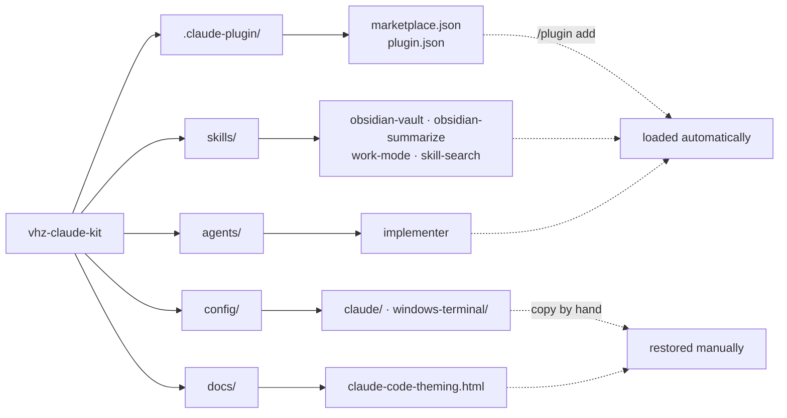

# vhz-claude-kit

Personal Claude Code kit — Obsidian second-brain skills, a delegation subagent, and the
machine config that makes a terminal session bearable to look at.

Installable as a plugin. The `config/` and `docs/` folders are restored by hand.



---

## Install

```
/plugin add https://github.com/VextorHorizon/vhz-claude-kit
```

Then set your vault path:

```powershell
# Windows
$env:OBSIDIAN_VAULT = "C:\Users\you\Documents\my-vault"
```
```bash
# macOS / Linux
export OBSIDIAN_VAULT="$HOME/Documents/my-vault"
```

`config/` and `docs/` are **not** loaded by the plugin — `plugin.json` lists skill paths
explicitly, so the loader never scans them. See [Config](#config) to restore those.

---

## Skills

| Skill | Trigger | What it does |
|---|---|---|
| `obsidian-vault` | "open vault", "load obsidian" | Loads the vault into context, activates ingest / query / lint / diary workflows |
| `obsidian-summarize` | "summarize for obsidian", "สรุปสิ่งที่คุยกัน" | Converts a conversation into a paste-ready Obsidian ingest block |
| `work-mode` | `/work-mode [project]` | Project execution session — loads progress, tracks tasks, writes checkpoints continuously |
| `skill-search` | `/skill-search [query]` | Finds the best installed skill for a need; falls back to skillsmp.com and GitHub |

## Agents

Auto-loaded from `agents/` at session start. **New agents only register on restart.**

| Agent | Model | Why it exists |
|---|---|---|
| `implementer` | Sonnet | Executes an already-agreed plan. Pinned to Sonnet so the main session stays on a stronger model for planning and review, and delegates the typing. |

---

## Config

Machine setup. Restored by hand — there is no installer, the steps are short and you should
see what lands where. Full detail in **[`config/README.md`](config/README.md)**.

```
config/
├─ claude/
│  ├─ settings.json            → ~/.claude/settings.json
│  └─ statusline-command.ps1   → ~/.claude/statusline-command.ps1
└─ windows-terminal/
   ├─ gruvbox-dark.json        → schemes[] in Windows Terminal settings.json
   └─ profile-defaults.json    → profiles.defaults in the same file
```

### Kaomoji statusline

```
(✿◠‿◠) editing | Opus 5 | 5h [###-------] 34% resets 2h11m | 7d [#####-----] 51% resets 3d4h
```

**Three coupled parts, not one file.** Restoring only the script gives you a permanently
blank tool slot — the most likely way this backup fails you later.

| Part | Lives in | Job |
|---|---|---|
| `statusline-command.ps1` | `~/.claude/` | Reads `current-tool.txt`, renders the line |
| `statusLine` block | `settings.json` | Tells Claude Code to run the script |
| `hooks` block | `settings.json` | `PreToolUse` **writes** the file; `PostToolUse` and `PostToolUseFailure` **delete** it |

`PostToolUseFailure` is not optional. Without it a failed tool call leaves the file behind
and the statusline sticks on a tool that already finished.

### Terminal theme

Gruvbox Dark plus the settings that actually drive readability:

| Setting | Why |
|---|---|
| `padding: "16"` | Stock is `0` — glyphs jam against the window edge. Biggest single win here. |
| `antialiasingMode: "grayscale"` | Default ClearType throws colored fringes on glyph edges; against Gruvbox's warm `#282828` they read as smudges. |
| `opacity: 92` + `useAcrylic` | Acrylic is required for opacity to look like blur instead of ghosting. Below ~80 contrast suffers. |
| `theme: "dark-ansi"` | Makes Claude Code emit ANSI colour slots instead of hardcoded hex, so the terminal scheme drives everything. Swap schemes later and Claude Code follows with no reconfiguration. |

Fonts are deliberately not pinned — set `font.face` per machine.

---

## Docs

**[`docs/claude-code-theming.html`](docs/claude-code-theming.html)** — interactive comparison
of eight terminal colour schemes with live padding, opacity, font and size controls, rendered
against a mock Claude Code session. Also covers `dark` vs `dark-ansi`, what `tweakcc` changes,
and statusline options.

Self-contained single file. Clone and open it in a browser, or [view it rendered][htmlpreview].

[htmlpreview]: https://htmlpreview.github.io/?https://github.com/VextorHorizon/vhz-claude-kit/blob/main/docs/claude-code-theming.html

---

## Vault structure expected

```
$OBSIDIAN_VAULT/
├── CLAUDE.md          ← schema + workflow rules (required)
├── index.md           ← page catalog
├── hotcaches.md       ← Q&A cache
├── log.md             ← append-only session log
├── data/
│   ├── daily/         ← session diary (YYYY-MM-DD.md)
│   ├── personal/
│   ├── research/
│   ├── reading/
│   ├── work/          ← project progress files (*-progress.md)
│   └── templates/
└── raw/               ← unprocessed input, deleted after ingest
```

### work-mode

```
/work-mode my-project    ← loads data/work/my-project-progress.md
/work-mode               ← lists all progress files to pick from
```

Every interaction is logged to `raw/session-YYYY-MM-DD.md` for later ingest.

---

## What was scrubbed before publishing

This repo is public. `config/claude/settings.json` is a filtered copy, not a raw one.

| | |
|---|---|
| **Dropped** | 57 of 101 `permissions.allow` entries — absolute user paths, client project names, third-party repos, localhost endpoints, and every wildcard that permits arbitrary code execution (`node *`, `npm run *`, `git clone *`, `gh api *`, …) |
| **Kept** | 44 on Windows, 27 on Linux. Read-only or non-executing patterns like `Bash(git add *)` and `PowerShell(Get-Content *)` |
| **Placeholdered** | `OBSIDIAN_VAULT` and the statusline path → `C:\Users\you`. **Both need editing on restore** — Claude Code does not expand `$env:` inside a `-File` argument |
| **Untouched** | `hooks`, `spinnerVerbs` (58 kaomoji), `enabledPlugins`, `extraKnownMarketplaces`, `model`, `effortLevel`, `tui` — nothing personal in them |

Re-run the sweep before any future commit touching `config/` or `docs/`:

```bash
grep -rniE 'C:\\+Users\\+[a-z]|localhost:[0-9]+|sk-|ghp_|api[_-]?key|password' config/ docs/
```

---

Personal backup — use at your own risk. MIT.
